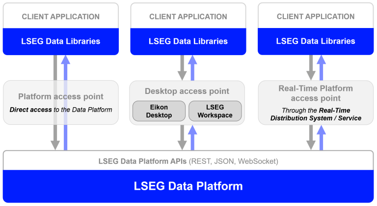
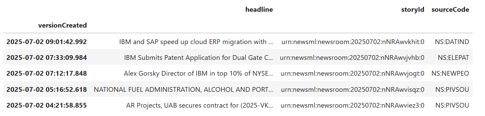
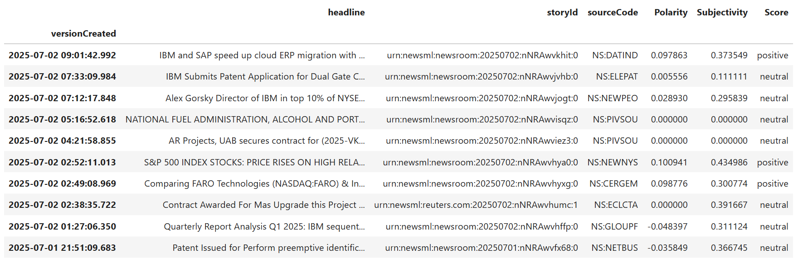
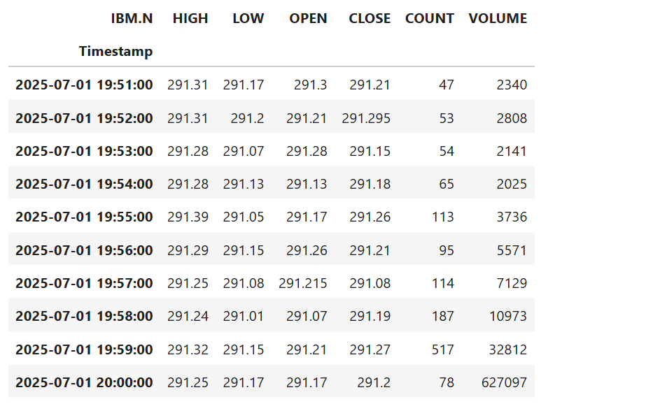
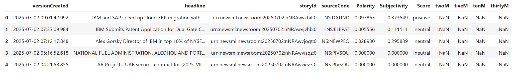
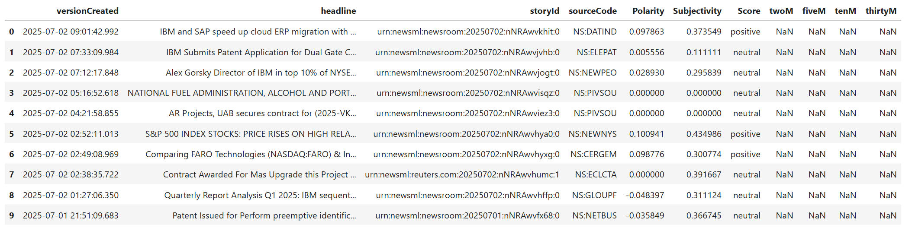
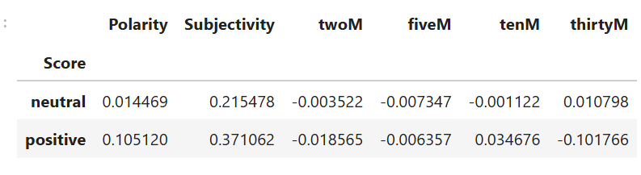
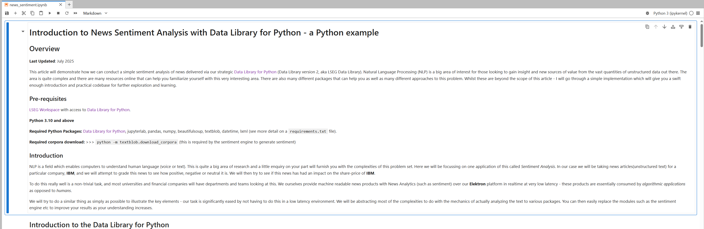

# Introduction to News Sentiment Analysis with Data Library - a Python example

## Overview

**Last Updated**: July 2025

This article will demonstrate how we can conduct a simple sentiment analysis of news delivered via our strategic [Data Library for Python](https://developers.lseg.com/en/api-catalog/lseg-data-platform/lseg-data-library-for-python) (Data Library version 2, aka LSEG Data Library). Natural Language Processing (NLP) is a big area of interest for those looking to gain insight and new sources of value from the vast quantities of unstructured data out there. The area is quite complex and there are many resources online that can help you familiarize yourself with this very interesting area. There are also many different packages that can help you as well as many different approaches to this problem. Whilst these are beyond the scope of this article - I will go through a simple implementation which will give you a swift enough introduction and practical codebase for further exploration and learning.


### Pre-requisites

[LSEG Workspace](https://www.lseg.com/en/data-analytics/products/workspace) with access to [Data Library for Python](https://developers.lseg.com/en/api-catalog/lseg-data-platform/lseg-data-library-for-python).

**Python 3.10 and above**

**Required Python Packages:** [Data Library for Python](https://pypi.org/project/lseg-data/), jupyterlab, pandas, numpy, beautifulsoup, textblob, datetime, lxml (see more detail on a ```requirements.txt``` file).

**Required corpora download:** >>> ```python -m textblob.download_corpora``` (this is required by the sentiment engine to generate sentiment)

### Introduction

NLP is a field which enables computers to understand human language (voice or text). This is quite a big area of research and a little enquiry on your part will furnish you with the complexities of this problem set. Here we will be focussing on one application of this called *Sentiment Analysis*. In our case we will be taking news articles(unstructured text) for a particular company, **IBM**, and we will attempt to grade this news to see how positive, negative or neutral it is. We will then try to see if this news has had an impact on the share-price of **IBM**. 

To do this really well is a non-trivial task, and most universities and financial companies will have departments and teams looking at this. We ourselves provide machine readable news products with News Analytics (such as sentiment) over our **Elektron** platform in realtime at very low latency - these products are essentially consumed by *algorithmic applications* as opposed to *humans*. 

We will try to do a similar thing as simply as possible to illustrate the key elements - our task is significantly eased by not having to do this in a low latency environment. We will be abstracting most of the complexities to do with the mechanics of actually analyzing the text to various packages. You can then easily replace the modules such as the sentiment engine etc to improve your results as your understanding increases.   

## <a id="rdp_lib"></a>Introduction to the Data Library for Python

The [Data Library for Python](https://developers.lseg.com/en/api-catalog/lseg-data-platform/lseg-data-library-for-python) provides a set of ease-of-use interfaces offering coders uniform access to the breadth and depth of financial data and services available on the Workspace, RDP, and Real-Time Platforms. The API is designed to provide consistent access through multiple access channels and target both Professional Developers and Financial Coders. Developers can choose to access content from the desktop, through their deployed streaming services, or directly to the cloud. With the Data Library, the same Python code can be used to retrieve data regardless of which access point you choose to connect to the platform.

 

The Data Library are available in the following programming languages:

- [Python](https://developers.lseg.com/en/api-catalog/lseg-data-platform/lseg-data-library-for-python)
- [.NET](https://developers.lseg.com/en/api-catalog/lseg-data-platform/lseg-data-library-for-net)
- [TypeScript](https://developers.lseg.com/en/api-catalog/lseg-data-platform/lseg-data-library-for-typescript)

For more deep detail regarding the Data Library for Python, please refer to the following articles and tutorials:

- [Quickstart](https://developers.lseg.com/en/api-catalog/lseg-data-platform/lseg-data-library-for-python/quick-start).
- [Documentation](https://developers.lseg.com/en/api-catalog/lseg-data-platform/lseg-data-library-for-python/documentation).
- [Tutorials](https://developers.lseg.com/en/api-catalog/lseg-data-platform/lseg-data-library-for-python/tutorials).
- [GitHub](https://github.com/LSEG-API-Samples/Example.DataLibrary.Python).

### Disclaimer

This project is based on Data Library Python versions **2.1.1**.

So lets get started. First lets load the packages that we will need to use.


```python
import lseg.data as ld
import pandas as pd
import numpy as np
from bs4 import BeautifulSoup
from textblob import TextBlob
import datetime
from datetime import time
import warnings
warnings.filterwarnings("ignore")
```

The next step is to open a session defined in a **lseg-data.config.json** configuration file in the same location as notebook file.

You should save a json file **lseg-data.config.json** having your Workspace App Key as follows:

```json
{
    "logs": {
        "level": "debug",
        "transports": {
            "console": {
                "enabled": false
            },
            "file": {
                "enabled": false,
                "name": "lseg-data-lib.log"
            }
        }
    },
    "sessions": {
        "default": "desktop.workspace",
        "desktop": {
            "workspace": {
                "app-key": "YOUR APP KEY GOES HERE!"
            }
        }
    }
}
```
This file should be readily available (e.g. in the current working directory) for the next steps.

Please note that the LSEG Workspace desktop application integrates the API proxy that acts as an interface between the Data library and the Workspace Platform. For this reason, the  Workspace application must be running when you use the Data library with Desktop Session. 

```python
ld.open_session(config_name='./lseg-data.config.json')
# should return something like <lseg.data.session.Definition object at 0x27a435dbe50 {name='workspace'}> message
```

There are two API calls for news:

```news.get_headlines()``` function allows you to retrieve news headlines via a single function call.

```news.get_story()``` function allows you to retrieve full news story data.

We will need to use both - thankfully they are really straightforward to use. We will need to use **get_news_headlines** API call to request a list of headlines. The first parameter for this call is a query. You don't really need to know this query language as you can generate it using the **News Monitor App** (type **NEWS** into Eikon search bar) in **Workspace**. 

You can see here I have just typed in 2 search terms, **IBM**, for the company, and, **English**, for the language I am interested in (in our example we will only be able to analyst English language text - though there are corpora, packages, methods you can employ to target other languages - though these are beyond the scope of this article). You can of course use any search terms you wish.

 

After you have typed in what you want to search for - we can simply click in the search box and this will then generate the query text which we can then copy and paste into the API call below. Its easy for us to change logical operations such as **AND** to **OR**, **NOT**  to suit our query. 

 

So the line of code below gets us 100 news headlines for **IBM** in english prior to 4th Dec 2017, and stores them in a dataframe object, ```df``` for us.


```python
df = ld.news.get_headlines('R:IBM.N AND Language:LEN', start = '2025-04-04', count=150)
df.head()
```




I will just add 3 new columns which we will need to store some variables in later.


```python
df['Polarity'] = np.nan
df['Subjectivity'] = np.nan
df['Score'] = np.nan
```

So we have our frame with the most recent 100 news headline items. The headline is stored in the **text** column and the storyID which we will now use to pull down the actual articles themselves, is stored in the **storyID** column. 

We will now iterate through the headline dataframe and pull down the news articles using the second of our news API calls, get_news_story. We simply pass the **storyID** to this API call and we are returned a HTML representation of the article - which allows you to render them nicely etc - however for our purposes we want to strip the HTML tags etc out and just be left with the plain text - as we don't want to analyst HTML tags for sentiment. We will do this using the excellent **BeautifulSoup** package.

Once we have the text of these articles we can pass them to our sentiment engine which will give us a sentiment score for each article. So what is our sentiment engine? We will be using the simple **TextBlob** package to demo a rudimentary process to show you how things work. **TextBlob** is a higher level abstraction package that sits on top of **NLTK** (Natural Language Toolkit) which is a widely used package for this type of task. 

**NLTK** is quite a complex package which gives you a lot of control over the whole analytical process - but the cost of that is complexity and required knowledge of the steps involved. **TextBlob** shields us from this complexity, but we should at some stage understand what is going on under the hood. Thankfully there is plenty of information to guide us in this. We will be implementing the default **PatternAnalyzer** which is based on the popular **Pattern** library though there is also a **NaiveBayesAnalyzer** which is a **NLTK** classifier based on a movie review corpus. 

All of this can be achieved in just a few lines of code. This is quite a dense codeblock - so I have commented the key steps.   


```python
for idx, storyId in enumerate(df['storyId'].values):  #for each row in our df dataframe
    newsText = ek.get_news_story(storyId) #get the news story
    if newsText:
        soup = BeautifulSoup(newsText,'lxml') #create a BeautifulSoup object from our HTML news article
        sentA = TextBlob(soup.get_text()) #pass the text only article to TextBlob to anaylse
        df['Polarity'].iloc[idx] = sentA.sentiment.polarity #write sentiment polarity back to df
        df['Subjectivity'].iloc[idx] = sentA.sentiment.subjectivity #write sentiment subjectivity score back to df
        if sentA.sentiment.polarity >= 0.05: # attribute bucket to sentiment polartiy
            score = 'positive'
        elif  -.05 < sentA.sentiment.polarity < 0.05:
            score = 'neutral'
        else:
            score = 'negative'
        df['Score'].iloc[idx] = score #write score back to df
df.head()
```




Looking at our dataframe we can now see 3 new columns on the right, *Polarity*, *Subjectivity* and *Score*. As we have seen *Polarity* is the actual sentiment polarity returned from **TextBlob** ranging from -1 (negative) to +1 (positive), *Subjectivity* is a measure (ranging from 0 to 1) where 0 is very objective and 1 is very subjective, and *Score* is simply a Positive, Negative or Neutral rating based on the strength of the polarities. 

We would now like to see what, if any, impact this news has had on the share price of **IBM**. There are many ways of doing this - but to make things simple, I would like to see what the average return is at various points in time **AFTER** the news has broken. I want to check if there are *aggregate differences* in the *average returns* from the Positive, Neutral and Negative buckets we created earlier.


```python
# Reset Index, make 'versionCreated' to be column

df.reset_index(inplace = True)
# Specify fields for HIGH LOW OPEN CLOSE COUNT and VOLUME
fields = ['HIGH_1','LOW_1','OPEN_PRC','TRDPRC_1','NUM_MOVES','ACVOL_UNS']

start = df['versionCreated'].min().replace(hour=0,minute=0,second=0,microsecond=0).strftime('%Y-%m-%d')
end = df['versionCreated'].max().replace(hour=0,minute=0,second=0,microsecond=0).strftime('%Y-%m-%d')
Minute = ld.get_history(['IBM.N'],fields=fields , start=start, end=end, interval='minute')

Minute.dropna(inplace= True)
Minute.rename(
    columns= {
        'HIGH_1':'HIGH',
        'LOW_1':'LOW',
        'OPEN_PRC': 'OPEN',
        'TRDPRC_1': 'CLOSE',
        'NUM_MOVES': 'COUNT',
        'ACVOL_UNS': 'VOLUME'
    },
    inplace= True
)
Minute.tail(10)

```




We will need to create some new columns for the next part of this analysis.


```python
df['twoM'] = np.nan
df['fiveM'] = np.nan
df['tenM'] = np.nan
df['thirtyM'] = np.nan
df.head(2)
```




OK so I now just need to get the timestamp of each news item, truncate it to minute data (ie remove second and microsecond components) and get the base sharep rice of **IBM** at that time, and at several intervals after that time, in our case *t+2 mins,t+5 mins, t+10 mins, t+30 mins*, calculating the % change for each interval. 

An important point to bear in mind here is that news can be generated at anytime - 24 hours a day - outside of normal market hours. So for news generated outside normal market hours for **IBM** in our case, we would have to wait until the next market opening to conduct our calculations. Of course there are a number of issues here concerning our ability to attribute price movement to our news item in isolation (basically we cannot). That said, there might be other ways of doing this - for example looking at **GDRs/ADRs** or surrogates etc - these are beyond the scope of this introductory article. In our example, these news items are simply discarded. 

We will now loop through each news item in the dataframe, calculate (where possible) and store the derived performance numbers in the columns we created earlier: twoM...thirtyM.


```python
for idx, newsDate in enumerate(df['versionCreated'].values):
    sTime = df['versionCreated'][idx]
    sTime = sTime.replace(second=0,microsecond=0)
    try:
        t0 = Minute.iloc[Minute.index.get_loc(sTime),2]
        df['twoM'][idx] = ((Minute.iloc[Minute.index.get_loc((sTime + datetime.timedelta(minutes=2))),3]/(t0)-1)*100)
        df['fiveM'][idx] = ((Minute.iloc[Minute.index.get_loc((sTime + datetime.timedelta(minutes=5))),3]/(t0)-1)*100)
        df['tenM'][idx] = ((Minute.iloc[Minute.index.get_loc((sTime + datetime.timedelta(minutes=10))),3]/(t0)-1)*100) 
        df['thirtyM'][idx] = ((Minute.iloc[Minute.index.get_loc((sTime + datetime.timedelta(minutes=30))),3]/(t0)-1)*100)
    except:
        pass
df.head()
```



Fantastic - we have now completed the analytical part of our study. Finally, we just need to aggregate our results by *Score* bucket in order to draw some conclusions. 


```python
numeric_cols = df.select_dtypes(include='number').columns
grouped = df.groupby(['Score'])[numeric_cols].mean()
grouped
```



And lastly, closing a session with Workspace to clean up resources.

```python
ld.close_session()
```

### Observations

From our initial results - it would appear that there might be some small directional differences in returns between the positive and neutral groups over shorter time frames (twoM and fiveM) after news broke. This is a pretty good basis for further investigation. So where could we go from here?

We have a relatively small *n* here so we might want to increase the size of the study. 

We might also want to try to separate out more positive or negative news - ie change the threshold of the buckets to try to identify more prominent sentiment articles - maybe that could have more of an impact on performance. 

In terms of capturing news impact - we have thrown a lot of news articles out as they happened outside of market hours - as it is more complex to ascertain impact - we might try to find a way of including some of this in our analysis - I mentioned looking at overseas listings **GDR/ADRs** or surrogates above. Alternatively, we could using **EXACTLY** the same process looking at all news for an index future - say the **S&P500 emini** - as this trades on Globex pretty much round the clock - so we would be throwing out a lot less of the news articles? Great I hear you cry - but would each news article be able to influence a whole index? Are index futures more sensitive to some types of articles than others? Is there a temporal element to this? These are all excellent questions. Or what about cryptocurrencies? They trade 24/7? and so on.

We could also investigate what is going on with our sentiment engine. We might be able to generate more meaningful results by tinkering with the underling processes and parameters. Using a different, more domain-specific corpora might help us to generate more relevant scores. 

You will see there is plenty of scope to get much more involved here. 

This article was intended as an introduction to this most interesting of areas. I hope to have de-mystified this area for you somewhat and shown how it is possible to get started with this type of complex analysis using only a few lines of code, a simple easy to use yet powerful API and some really fantastic packages, to generate some meaningful results.

### Running the Notebook example.

1. Open a Command Prompt and go to project's folder
2. Run the following command in a Command Prompt to create a Python virtual environment named *news* for the project.

    ```bash
    $>python -m venv news
    ```

3. Once the environment is created, activate a virtual environment named ```news``` with this command in a Command Prompt

    ```bash
    $>news\Scripts\activate
    ```

4. Go to project's notebook folder and update a contain in ```lseg-data.config.json``` file with the your App-Key

    ```json
    {
        "logs": {
            "level": "debug",
            "transports": {
                "console": {
                    "enabled": false
                },
                "file": {
                    "enabled": false,
                    "name": "lseg-data-lib.log"
                }
            }
        },
        "sessions": {
            "default": "desktop.workspace",
            "desktop": {
                "workspace": {
                    "app-key": "YOUR APP KEY GOES HERE!"
                }
            }
        }
    }
    ```

5. Run the following command in a Command Prompt to install the project dependencies

    ```bash
    $>(news) pip install -r requirements.txt
    ```

6. In the current Command Prompt, go to project's notebook folder. Run the following command to start Jupyter Lab in the notebook folder.

    ```bash
    $>(news)>jupyter lab
    ```

7. Open *news_sentiment.ipynb* Notebook document, then follow through each notebook cell.

    

**Note**: If you are using AnaConda/MiniConda, please refer to this [Conda - Managing environments document](https://docs.conda.io/projects/conda/en/stable/user-guide/tasks/manage-environments.html) for more detail about how create and activate environment with Conda.

## <a id="references"></a>References

You can find more detail regarding the Data Library and related technologies for this Notebook from the following resources:

- [LSEG Data Library for Python](https://developers.lseg.com/en/api-catalog/lseg-data-platform/lseg-data-library-for-python) on the [LSEG Developer Community](https://developers.lseg.com/)
- [Data Library for Python - Reference Guide](https://developers.lseg.com/en/api-catalog/lseg-data-platform/lseg-data-library-for-python/documentation#reference-guide)
- [The Data Library for Python  - Quick Reference Guide (Access layer)](https://developers.lseg.com/en/article-catalog/article/the-data-library-for-python-quick-reference-guide-access-layer) article.
- [Essential Guide to the Data Libraries - Generations of Python library (EDAPI, RDP, RD, LD)](https://developers.lseg.com/en/article-catalog/article/essential-guide-to-the-data-libraries) article.
- [Upgrade from using Eikon Data API to the Data library](https://developers.lseg.com/en/article-catalog/article/Upgrade-from-using-Eikon-Data-API-to-the-Data-library) article.
- [Data Library for Python Examples on GitHub](https://github.com/LSEG-API-Samples/Example.DataLibrary.Python) repository.

For any question related to this example or Data Library, please use the Developers Community [Q&A Forum](https://community.developers.refinitiv.com).
